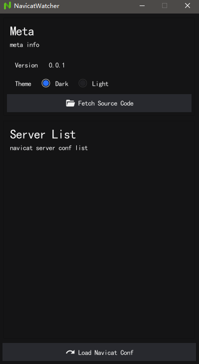
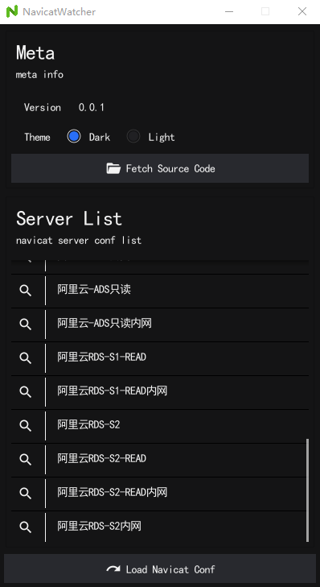
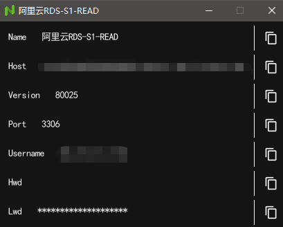

# Navicat Watcher

## Background

When using Navicat, we may forget the passwords of existed servers(Hosts), **Navicat Watcher** is a helpful local tool to load server config list from system registry(Windows System only).

## Install

Ensure you have installed golang environment, then checkout the source code of this project, install all dependencies and run it: 

```shell
cd $project
go mod tidy
go run .
```

## Usage

Startup **Navicat Watcher**, main window:



Press the 'Loan Navicat Conf' button to reload all navicat servers:



Press the '🔍' button to view the navicat server info:



|  Field   |                    Description                     |
|:--------:|:--------------------------------------------------:|
|   Name   |                 server(Host) name                  |
|   Host   |                   database host                    |
| Version  |                  database version                  |
|   Port   |                   database port                    |
| Username |                 database username                  |
|   Hwd    |     higher (navicat) version database password     |
|   Lwd    |     lower (navicat) version database password      |

You can press the 'copy' button on the right to copy the item content to system clipboard.

## Related Efforts

- [how-does-navicat-encrypt-password](https://github.com/HyperSine/how-does-navicat-encrypt-password)
- [fyne](https://github.com/fyne-io/fyne)

## Warning

- **Warning** - This project is for reference and learning only, for use in local environments
- **警告** - 此项目仅供参考和学习，用于本地环境使用


